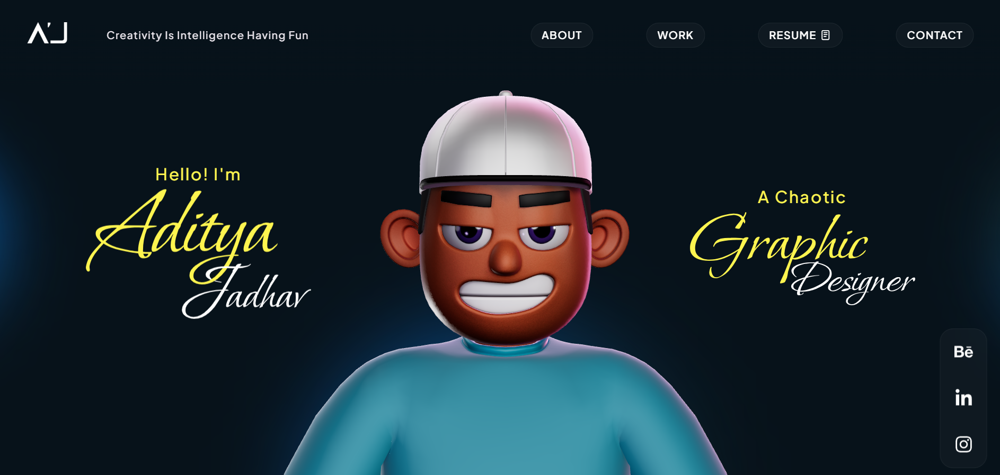

# Aditya Jadhav | Creative Portfolio



A high-performance, interactive creative portfolio designed to showcase a decade of experience in graphic design and visual storytelling. Built with modern web technologies for a seamless, immersive user experience.

## 🚀 Key Modules & Features

*   **Interactive 3D Stage**: A custom-built Three.js environment featuring an animated character and dynamic camera controls.
*   **Magic Rings & Galaxy**: High-performance visual effects for background and transition elements.
*   **Snappy Motions**: A fluid, video-centric carousel showcasing motion graphics and design showreels.
*   **Work Showcase**: A responsive, categorized project gallery with smooth "LEGO Piece" style transitions.
*   **Career Timeline**: An organized experience section reflecting a professional journey through graphic design and consultancy.
*   **Custom Cursor & UX**: Magnetic cursor effects and fluid scrolling using GSAP and Framer Motion.

## 🛠️ Tech Stack

*   **Frontend**: [React](https://reactjs.org/) + [Vite](https://vitejs.dev/)
*   **3D / Graphics**: [Three.js](https://threejs.org/) (React Three Fiber, Drei), [OGL](https://github.com/oframe/ogl)
*   **Animations**: [GSAP](https://greensock.com/gsap/), [Framer Motion](https://www.framer.com/motion/)
*   **Styling**: Vanilla CSS (Custom Teal & Midnight Theme)

## 📦 Installation & Setup

1.  **Clone the Repository**:
    ```bash
    git clone https://github.com/your-username/aditya-portfolio.git
    ```
2.  **Install Dependencies**:
    ```bash
    npm install
    ```
3.  **Run Locally**:
    ```bash
    npm run dev
    ```

---

## ⚖️ Copyright & Assets (IMPORTANT)

**Copyright © 2026 Aditya Jadhav. All rights reserved.**

*   **Design & Assets**: All professional "work files," including but not limited to project images (`.webp`), videos, and the unique layout/branding of this site, are strictly proprietary. These files are **NOT** for public or commercial use and may not be redistributed or reused in any form without express written permission.
*   **Components**: While this project incorporates several open-source libraries and public components (such as Framer Motion, GSAP, and Three.js modules), the specific integration, branding, and original creative work presented here are personal property.

---

Designed and Developed by **Aditya Jadhav**.
